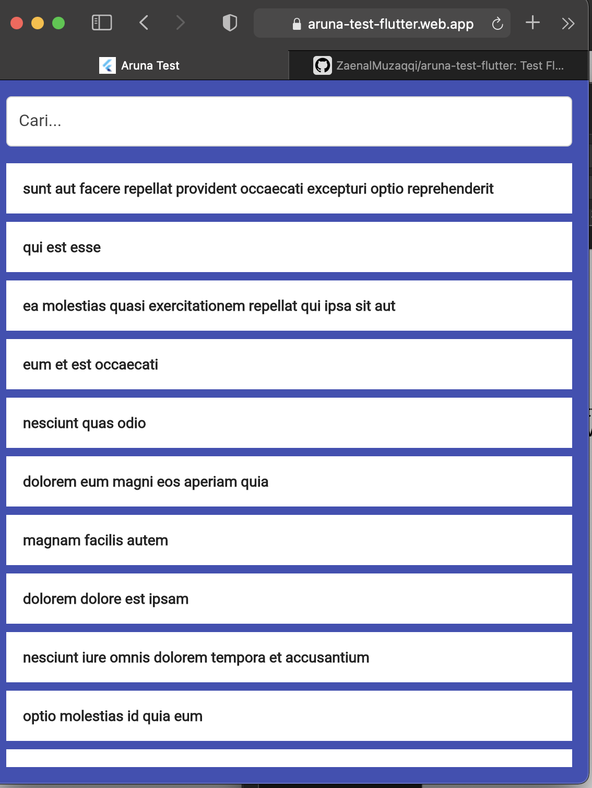
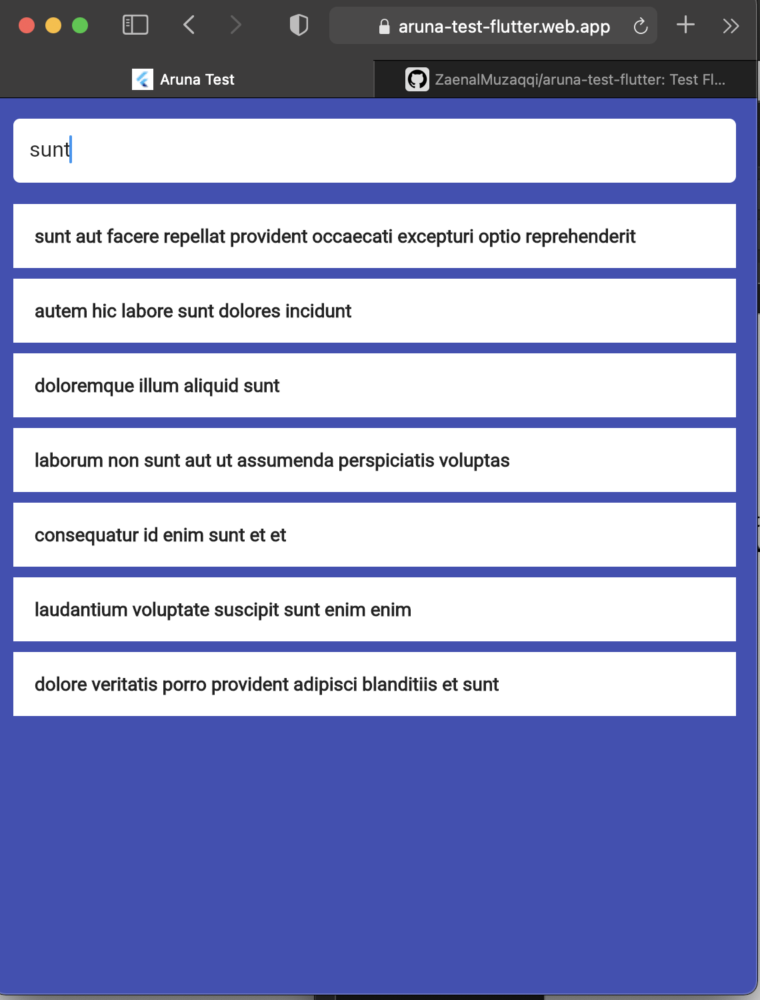
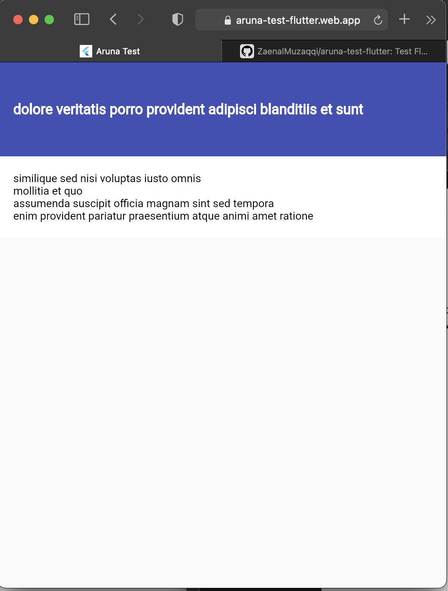

# aruna_test

ARUNA FLUTTER TEST.

## Link
- [​Github : https://github.com/ZaenalMuzaqqi/aruna-test-flutter/](https://github.com/ZaenalMuzaqqi/aruna-test-flutter/)
- [​Firebase Web : https://aruna-test-flutter.web.app/#/](https://aruna-test-flutter.web.app/#/)

1. Interasksi dengan API menggunakan package Dio  
2. Menggunakan  State Management bLoc  
3. Generate model mengguanakn Freezed  
   
## Package yang digunakan

- bloc: ^8.1.0
- bloc_test: ^9.1.0
- build_runner: ^2.2.1
- cupertino_icons: ^1.0.2
- dio: ^4.0.6
- flutter_bloc: ^8.1.1
- freezed_annotation: ^2.1.0
- json_annotation: ^4.7.0
- nv_cubit_testing: ^0.0.8+1
- freezed: ^2.1.1
- json_serializable: ^6.5.0

## Tampilan
        